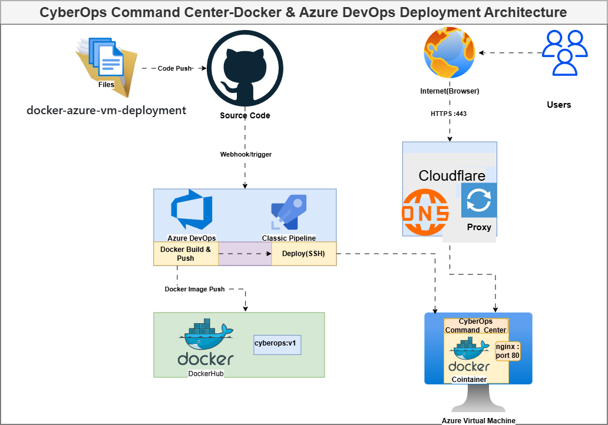

# CyberOps Command Center

> A static cybersecurity operations dashboard containerized with Docker and Nginx, deployed on an Azure Ubuntu VM through an Azure DevOps Classic CI/CD pipeline.

---

## Table of Contents

1. [Project Overview](#1-project-overview)
2. [Architecture](#2-architecture)
3. [Key Features](#3-key-features)
4. [Technology Stack](#4-technology-stack)
5. [Repository Structure](#5-repository-structure)
6. [Docker Implementation](#6-docker-implementation)
7. [Azure VM Deployment](#7-azure-vm-deployment)
8. [Azure DevOps Classic CI/CD Pipeline](#8-azure-devops-classic-cicd-pipeline)
9. [Self-Hosted Agent](#9-self-hosted-agent)
10. [Docker Hub](#10-docker-hub)
11. [Evidence & Screenshots](#11-evidence--screenshots)
12. [Deployment Documentation](#12-deployment-documentation)
13. [Troubleshooting](#13-troubleshooting)
14. [Security Considerations](#14-security-considerations)
15. [Future Improvements](#15-future-improvements)
16. [Learning Outcomes](#16-learning-outcomes)
17. [Author](#17-author)

---

## 1. Project Overview

**CyberOps Command Center** is a portfolio-grade DevOps project built to demonstrate end-to-end containerized application deployment using real-world cloud and DevOps tooling.

The application itself is a static cybersecurity operations dashboard built with HTML5, CSS3, and Vanilla JavaScript. It simulates a security operations center (SOC) interface with components such as a live alert feed, charts, a navigation panel, and an interactive terminal.

The primary goal of this project is **not** the application logic itself, but the complete DevOps implementation surrounding it:

- Packaging the application into a portable Docker container
- Automating the build and publish process through an Azure DevOps Classic Pipeline
- Running a self-hosted Linux agent directly on the deployment target (Ubuntu Azure VM)
- Pushing the image to Docker Hub as a public registry
- Running the containerized application behind an Nginx web server on a cloud VM

This project was built as a practical learning exercise to develop real skills in Docker, Linux, cloud infrastructure (Azure), and CI/CD automation.

---

## 2. Architecture

### Architecture Diagram



### CI/CD Flow

```
Developer (Local)
       │
       ▼
   GitHub Repository
  (InquistiveSantu/docker-azure-vm-deployment)
       │
       ▼
  Azure DevOps Classic Pipeline
  (Triggered on commit)
       │
       ▼
  Self-Hosted Linux Agent
  (CyberOps-Linux-Agent on Azure Ubuntu VM: santulinuxvm)
       │
       ├──► Docker Build
       │         └── docker build -t inquistivesantu/cyberops-command-center .
       │
       ├──► Docker Hub Push
       │         └── inquistivesantu/cyberops-command-center
       │
       └──► Docker Run on Azure VM
                 └── Nginx Alpine container → CyberOps Command Center (Port 80)
```

The pipeline runs entirely on the Azure VM itself. The self-hosted agent checks out the code from GitHub, builds the Docker image locally, pushes it to Docker Hub, and then runs the updated container — all on the same machine.

---

## 3. Key Features

### Application Features

| Feature | Description |
|---|---|
| Dashboard | Overview panel simulating a SOC command center |
| Alerts | Live security alert feed module |
| Charts | Data visualization charts for security metrics |
| Terminal | Interactive terminal simulation panel |
| Navigation | Multi-section navigation system |
| Responsive UI | CSS3-based styling for clean layout |

### DevOps Features

| Feature | Description |
|---|---|
| Containerization | Application packaged as a Docker image using nginx:alpine |
| Image Registry | Published to Docker Hub as a public image |
| CI/CD Automation | Azure DevOps Classic Pipeline (no YAML) |
| Self-Hosted Agent | Ubuntu Azure VM registered as Azure DevOps agent |
| Cloud Deployment | Runs on an Azure Ubuntu VM behind Nginx |
| Network Security | Azure NSG inbound rules for HTTP/SSH access |
| Secret Management | Docker Hub credentials via Azure DevOps service connection |

---

## 4. Technology Stack

| Category | Technology |
|---|---|
| **Application** | HTML5, CSS3, Vanilla JavaScript |
| **Web Server** | Nginx (Alpine) |
| **Containerization** | Docker |
| **Container Registry** | Docker Hub |
| **CI/CD** | Azure DevOps Classic Pipeline |
| **Cloud** | Microsoft Azure (Virtual Machine, NSG, Networking) |
| **Operating System** | Ubuntu Linux (Azure VM) |
| **Version Control** | Git / GitHub |

---

## 5. Repository Structure

```
docker-azure-vm-deployment/
├── app/                        # Static web application source
│   ├── index.html              # Main HTML entry point
│   ├── style.css               # Application stylesheet
│   └── js/                     # JavaScript modules
│       ├── alerts.js           # Alert feed module
│       ├── charts.js           # Charts/data visualization module
│       ├── dashboard.js        # Dashboard logic
│       ├── main.js             # Application entry point
│       ├── nav.js              # Navigation module
│       └── terminal.js         # Terminal simulation module
│
├── docs/                       # Project documentation & evidence
│   ├── architecture/           # Architecture diagrams (.drawio, .png, .svg)
│   ├── screenshots/            # UI and tool screenshots (organized by category)
│   │   ├── application/        # Application UI screenshots
│   │   ├── azure/              # Azure VM screenshots
│   │   ├── cloudflare/         # Cloudflare configuration screenshots
│   │   ├── docker/             # Docker build/run screenshots
│   │   ├── dockerhub/          # Docker Hub screenshots
│   │   └── pipeline/           # Azure DevOps pipeline screenshots
│   ├── evidence/               # Deployment evidence artifacts
│   │   ├── azure-deployment/   # Azure VM, agent, service connection evidence
│   │   ├── docker-build/       # Docker image build evidence
│   │   ├── docker-push/        # Docker Hub push evidence
│   │   └── pipeline-runs/      # Pipeline execution evidence
│   └── deployment/             # Deployment guides
│       ├── azure-devops.md
│       ├── azure-vm.md
│       ├── cloudflare.md
│       └── docker.md
│
├── Dockerfile                  # Container build instructions
├── docker-compose.yml          # Docker Compose configuration
├── .dockerignore               # Docker build context exclusions
├── .gitignore                  # Git exclusions
├── LICENSE                     # Project license
└── README.md                   # This file
```

---

## 6. Docker Implementation

### Dockerfile

```dockerfile
FROM nginx:alpine
COPY app/ /usr/share/nginx/html/
EXPOSE 80
CMD ["nginx", "-g", "daemon off;"]
```

### Design Decisions

| Decision | Reason |
|---|---|
| `nginx:alpine` base image | Lightweight, minimal footprint, production-suitable for serving static files |
| `COPY app/ /usr/share/nginx/html/` | Places all static assets into Nginx's default web root |
| `EXPOSE 80` | Declares the container's HTTP port |
| `CMD ["nginx", "-g", "daemon off;"]` | Runs Nginx in the foreground so the container stays alive |

### Example Commands

```bash
# Build the Docker image
docker build -t inquistivesantu/cyberops-command-center .

# Run the container (maps host port 80 to container port 80)
docker run -d -p 80:80 --name cyberops inquistivesantu/cyberops-command-center

# List running containers
docker ps
```

> **Note:** The Docker build and push steps are automated through the Azure DevOps Classic Pipeline. The commands above are provided as reference for local use.

---

## 7. Azure VM Deployment

The application runs inside a Docker container on an **Ubuntu Azure Virtual Machine**.

**Infrastructure summary:**

| Component | Details |
|---|---|
| Cloud Provider | Microsoft Azure |
| VM Type | Ubuntu Linux Virtual Machine |
| Web Server | Nginx (running inside Docker container) |
| Container Image | `inquistivesantu/cyberops-command-center` (pulled from Docker Hub) |
| Access | Azure VM Public IP address over port 80 |
| Network Security | Azure NSG inbound rule allowing HTTP (port 80) and SSH (port 22) |

The Nginx Docker container serves the static CyberOps Command Center application directly. The application is accessed via the VM's public IP address (HTTP, port 80).

> Cloudflare DNS/HTTPS integration was explored but not fully completed. The final working deployment is accessed over the Azure VM's public IP address directly.

---

## 8. Azure DevOps Classic CI/CD Pipeline

> **Important:** This project uses an **Azure DevOps Classic Pipeline** (UI-configured, task-based). It does **not** use a YAML pipeline file.

### Pipeline Overview

The pipeline is configured in the Azure DevOps portal using the Classic visual editor. It is triggered automatically when changes are pushed to the GitHub repository.

### Pipeline Steps (in order)

| Step | Task | Description |
|---|---|---|
| 1 | **Checkout** | Agent checks out the latest source code from GitHub |
| 2 | **Docker Build** | Runs `docker build` to build the image from the Dockerfile |
| 3 | **Docker Push** | Authenticates via Docker Hub service connection and pushes the image to Docker Hub |
| 4 | **Deploy** | Runs the updated container on the Azure VM using `docker run` |

### Key Configuration Details

- **Agent Pool:** `CyberOps-Linux-Agent` (self-hosted)
- **Docker Hub Auth:** Azure DevOps Docker Registry service connection (no credentials stored in code)
- **Trigger:** Repository branch/commit trigger
- **Pipeline Type:** Classic (not YAML)

Since the self-hosted agent runs **on the same Azure VM** as the deployment target, the pipeline can build, push, and run the container in a single agent job.

---

## 9. Self-Hosted Agent

### Why a Self-Hosted Agent?

Microsoft-hosted agents do not have persistent access to the Azure VM environment. To build and deploy directly onto the Azure VM, the VM itself was registered as an Azure DevOps **self-hosted agent**. This eliminates the need for SSH deployment steps or remote execution — the agent runs the Docker commands locally on the target machine.

### Agent Configuration

| Property | Value |
|---|---|
| **Agent Name** | `CyberOps-Linux-Agent` |
| **Agent Pool** | `CyberOps-Linux-Agent` |
| **Machine** | `santulinuxvm` |
| **OS** | Ubuntu Linux |
| **Capability** | Docker, Git |

The agent is configured to run as a service on the Ubuntu VM, polling Azure DevOps for jobs and executing them in the configured work folder.

---

## 10. Docker Hub

The Docker image for this project is published to Docker Hub under:

**`inquistivesantu/cyberops-command-center`**

- The image is built by the Azure DevOps pipeline on the self-hosted agent.
- Authentication to Docker Hub is handled through an Azure DevOps **Docker Registry service connection** — no credentials are stored in the repository.
- Each successful pipeline run pushes an updated image to the registry.

---

## 11. Evidence & Screenshots

### Application

| Screenshot | Description |
|---|---|
|  | CyberOps Command Center — main dashboard view |
|  | CyberOps Command Center — additional UI section |

---

### Azure VM

| Screenshot | Description |
|---|---|
|  | Azure Virtual Machine running in Azure Portal |

---

### Docker Build & Container

| Screenshot | Description |
|---|---|
|  | Docker image build output |
|  | Docker container running on Azure VM |

---

### Docker Hub

| Screenshot | Description |
|---|---|
|  | Docker Hub image repository |

---

### Azure DevOps Pipeline

| Screenshot | Description |
|---|---|
|  | Azure DevOps Classic Pipeline run — overview |
|  | Azure DevOps Classic Pipeline run — task details |
|  | Docker Hub service connection configuration |
|  | Self-hosted agent registered in Azure DevOps |
|  | Pipeline task commands configuration |

---

### Cloudflare (Attempted)

| Screenshot | Description |
|---|---|
|  | Cloudflare DNS/proxy configuration (attempted, not completed) |

---

### Evidence Artifacts

The `docs/evidence/` folder contains raw deployment evidence organized by category:

| Folder | Contents |
|---|---|
| `docs/evidence/azure-deployment/` | `AzureVm.png`, `AgentVm.png`, `DockerServiceConnection.png`, `dockerpush.png` |
| `docs/evidence/docker-build/` | `dockerbuild.png` |
| `docs/evidence/docker-push/` | `dockerpush.png` |
| `docs/evidence/pipeline-runs/` | `PipelineRun1.png`, `PipelineRun2.png`, `PipelineCommands.png` |

---

## 12. Deployment Documentation

Detailed deployment guides are available under `docs/deployment/`:

| Document | Description |
|---|---|
| [azure-devops.md](docs/deployment/azure-devops.md) | Azure DevOps Classic Pipeline setup and configuration |
| [azure-vm.md](docs/deployment/azure-vm.md) | Azure VM infrastructure setup and deployment process |
| [docker.md](docs/deployment/docker.md) | Docker containerization guide |
| [cloudflare.md](docs/deployment/cloudflare.md) | Cloudflare DNS/SSL configuration (attempted) |

---

## 13. Troubleshooting

The following are real issues encountered during this project, along with their resolutions.

---

### Issue 1: Docker Tag / Push Failure

**Problem:** The Docker image was built without a tag, causing the push step to fail or push to the wrong repository.

**Fix:** Explicitly tag the image with the full Docker Hub image name during the build step:
```bash
docker build -t inquistivesantu/cyberops-command-center .
```

---

### Issue 2: Dockerfile CMD Syntax Error

**Problem:** The `CMD` instruction was initially written as a shell string, which caused Nginx to fail on startup.

**Fix:** Use the exec form (JSON array) for the `CMD` instruction:
```dockerfile
CMD ["nginx", "-g", "daemon off;"]
```

---

### Issue 3: Self-Hosted Windows Agent Missing Docker

**Problem:** The initial self-hosted agent was configured on a Windows machine, which did not have Docker installed. The Docker build step failed immediately.

**Fix:** Switched to a self-hosted agent running on the **Ubuntu Azure VM**, which had Docker installed and was the intended deployment target.

---

### Issue 4: Incorrect Azure DevOps Agent Work Folder Configuration

**Problem:** The agent work folder was misconfigured, causing the pipeline to check out code to an unexpected location, which broke the Docker build context path.

**Fix:** Reconfigured the agent work folder to a correct, accessible path on the Ubuntu VM during agent setup.

---

### Issue 5: Docker Build Context Configuration

**Problem:** The pipeline Docker build task was not correctly set to use the repository root as the build context, causing the `COPY app/` instruction in the Dockerfile to fail (files not found).

**Fix:** Explicitly set the build context to the repository root (`.`) in the Azure DevOps Docker task configuration to ensure the `app/` directory was available during the build.

---

## 14. Security Considerations

| Practice | Implementation |
|---|---|
| No secrets in code | All credentials and tokens are excluded from the repository |
| Docker Hub authentication | Managed through Azure DevOps Docker Registry **service connection** |
| PAT / Access Token storage | Personal Access Tokens used for agent registration must be stored securely and never committed |
| `.gitignore` | Prevents accidental commits of sensitive or environment-specific files |
| `.dockerignore` | Excludes unnecessary files from the Docker build context |
| NSG rules | Azure Network Security Group is configured with specific inbound rules (only required ports) |

---

## 15. Future Improvements

> The items below are planned enhancements — they are **not** part of the current implementation.

- **HTTPS with a valid domain** — Configure a proper domain name with SSL/TLS termination (e.g., via Cloudflare or Let's Encrypt)
- **Cloudflare DNS integration** — Complete the DNS and proxy setup to route traffic through Cloudflare
- **Automated deployment stage** — Add a dedicated CD stage to the pipeline that automatically pulls and restarts the container post-push
- **Container health checks** — Add Docker `HEALTHCHECK` instructions to the Dockerfile
- **Monitoring & logging** — Integrate container log forwarding and uptime monitoring (e.g., Azure Monitor, Prometheus)
- **Image vulnerability scanning** — Add a pipeline step to scan the Docker image for known vulnerabilities (e.g., Trivy)
- **Infrastructure as Code** — Replace manual Azure VM provisioning with Terraform or Bicep templates
- **Multi-stage Docker build** — Optimize the image further with multi-stage builds if a build step is introduced
- **Docker Compose deployment** — Fully populate and use `docker-compose.yml` for managing the container stack

---

## 16. Learning Outcomes

This project provided hands-on practical experience with:

| Area | Skills Gained |
|---|---|
| **Docker** | Writing Dockerfiles, building images, tagging, running containers, publishing to a registry |
| **Linux** | Working on Ubuntu server, managing Docker daemon, configuring services |
| **Azure VM** | Provisioning a virtual machine, configuring NSGs, managing public IP access |
| **Azure DevOps Classic Pipelines** | Building UI-configured pipelines, adding tasks, managing triggers |
| **Self-Hosted Agents** | Registering and configuring an Azure DevOps self-hosted Linux agent |
| **Docker Hub** | Pushing and managing public Docker images |
| **CI/CD** | Understanding the full build → push → deploy automation flow |
| **Nginx** | Serving static web content inside a containerized Nginx environment |
| **Troubleshooting** | Diagnosing and resolving real build, agent, and deployment failures |

---

## 17. Author

**Santu Paira**

- [LinkedIn]
- [GitHub]

---

## License

This project is licensed under the terms of the [LICENSE](LICENSE) file included in this repository.
